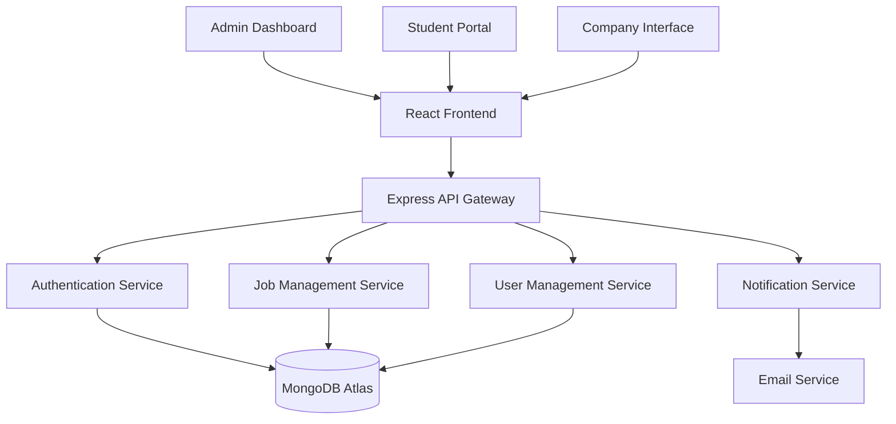

# 🎓 Placement Management System (PMS-CGC-U)

<div align="center">


[](https://choosealicense.com/licenses/mit/)
[](CONTRIBUTING.md)


### 🚀 **The Future of Campus Placement Management**

*An open-source, college-ready placement portal to **automate and modernize campus recruitment** — powered by the **MERN stack***

[](README.md)
[](README.md)

---


</div>

## 🌟 **Vision: A Plug-and-Play Placement Portal for Every College**

> **"Transforming spreadsheet chaos into streamlined success"**

Most colleges still rely on outdated spreadsheets and manual processes for placements. We're building a revolutionary system that changes everything:

<div align="center">

### 📊 **Impact Matrix**

| 🚀 **What We Offer** | ⚡ **Traditional Way** | 🎯 **Our Solution** | 📈 **Impact** |
|:---:|:---:|:---:|:---:|
| **Easy Deployment** | Manual setup for weeks | Setup in minutes | ⚡ 99% time saved |
| **Smart Filtering** | Excel filters & sorting | AI-powered matching | 🎯 Zero manual work |
| **Real-time Updates** | Email chains & calls | Live notifications | 📱 Instant communication |
| **Analytics Dashboard** | No insights | Data-driven decisions | 📊 Strategic advantage |
| **100% Open Source** | Expensive licenses | Free forever | 💰 $0 cost |

</div>

---

## 🔗 **Quick Navigation**

<div align="center">

[](#-placement-management-system-pms-cgc-u)
[](#-key-features-that-set-us-apart)
[](#️-modern-tech-stack)
[](#-quick-start-guide)
[](#-join-our-mission---contributors-wanted)

---

[](https://github.com/Mohitjadaun2026/PMS-CGC-U)
[](frontend/)
[](backend/)

</div>

---

## ✨ **Key Features That Set Us Apart**

<details>
<summary><h3>👨‍💼 <strong>Admin Control Center</strong> - <em>Complete placement management at your fingertips</em></h3></summary>

<div align="center">

| Feature | Description | Status | Priority |
|:---|:---|:---:|:---:|
| 🎯 **Smart Job Posting** | Create detailed job listings with company branding | ✅ | 🔥 |
| 🔍 **Intelligent Filtering** | Auto-filter students by branch, year, and eligibility | 🚧 | 🔥 |
| 📊 **Real-time Analytics** | Track applications, success rates, and trends | 🚧 | 🔥 |
| 📧 **Bulk Communications** | Send targeted emails via Nodemailer integration | 📋 | ⚡ |
| 🏢 **Company Management** | Handle logos, details, and deadlines seamlessly | ✅ | 🔥 |
| 📈 **Performance Metrics** | Comprehensive placement statistics and reports | 📋 | ⚡ |

</div>

**Key Capabilities:**
- **Drag & Drop Interface** - Intuitive job posting workflow
- **Template System** - Pre-built email and job templates
- **Approval Workflows** - Multi-level approval process
- **Audit Trails** - Complete activity logging
- **Bulk Operations** - Mass updates and communications

</details>

<details>
<summary><h3>👨‍🎓 <strong>Student Experience Portal</strong> - <em>Personalized placement journey for every student</em></h3></summary>

<div align="center">

| Feature | Description | Status | Priority |
|:---|:---|:---:|:---:|
| 🎯 **Personalized Feed** | See only jobs you're eligible for | 🚧 | 🔥 |
| 📱 **One-Click Applications** | Apply instantly through the dashboard | 🚧 | 🔥 |
| 📈 **Application Tracking** | Monitor status of all your applications | 🚧 | 🔥 |
| 🔔 **Smart Notifications** | Get updates via email and dashboard | 📋 | ⚡ |
| 📄 **Resume Builder** | AI-powered resume creation and optimization | 📋 | ⚡ |
| 📚 **Preparation Hub** | Interview tips, coding practice, and resources | 📋 | 🎯 |

</div>

**Student Benefits:**
- **Zero Missed Opportunities** - Never miss a relevant job posting
- **Application History** - Complete record of all applications
- **Progress Tracking** - Visual progress indicators
- **Interview Scheduler** - Built-in calendar integration
- **Peer Insights** - Anonymous feedback and tips

</details>

<details>
<summary><h3>🏢 <strong>Company Integration Hub</strong> - <em>Professional interface for recruiters</em></h3></summary>

<div align="center">

| Feature | Description | Status | Priority |
|:---|:---|:---:|:---:|
| 🎨 **Brand Showcase** | Professional display of job listings | ✅ | 🔥 |
| 🎯 **Targeted Reach** | Access pre-filtered, eligible candidates | 📋 | 🔥 |
| 📋 **Applicant Management** | Organize and evaluate applications | 📋 | ⚡ |
| 📞 **Communication Tools** | Direct messaging with candidates | 📋 | ⚡ |
| 📊 **Recruitment Analytics** | Track hiring funnel and success rates | 📋 | 🎯 |
| 🤖 **AI Screening** | Automated initial candidate screening | 📋 | 🚀 |

</div>

**Recruiter Advantages:**
- **Quality over Quantity** - Pre-screened, eligible candidates only
- **Streamlined Process** - End-to-end recruitment workflow
- **Data-Driven Decisions** - Analytics and insights
- **Brand Presence** - Professional company profiles
- **Efficient Communication** - Built-in messaging system

</details>

---

## 🛠️ **Modern Tech Stack**

<div align="center">


</div>

### **🏗️ Architecture Overview**

<div align="center">



</div>

### **🔧 Technology Breakdown**

<div align="center">

| **Layer** | **Technology** | **Purpose** | **Version** |
|:---:|:---:|:---:|:---:|
| 🎨 **Frontend** | React.js + Tailwind CSS | Modern, responsive UI | 18.x |
| ⚡ **Backend** | Node.js + Express.js | Scalable REST API | 18.x |
| 🗄️ **Database** | MongoDB Atlas | Cloud-native data storage | 6.x |
| 🔐 **Authentication** | JWT + bcrypt | Secure user management | Latest |
| 📧 **Email Service** | Nodemailer | Automated notifications | 6.x |
| 🎨 **Styling** | Tailwind CSS | Utility-first CSS framework | 3.x |
| 📦 **State Management** | React Context/Redux | Application state | Latest |
| 🧪 **Testing** | Jest + React Testing Library | Unit & Integration tests | Latest |

</div>

### **🚀 Performance Features**

- **⚡ Lightning Fast** - Optimized React components with lazy loading
- **📱 Mobile First** - Responsive design for all devices  
- **🔄 Real-time Updates** - WebSocket integration for live notifications
- **🎯 SEO Optimized** - Server-side rendering ready
- **🛡️ Security First** - JWT authentication, input validation, CORS protection
- **📊 Analytics Ready** - Built-in tracking and metrics

---

## 🚀 **Quick Start Guide**

### **📋 Prerequisites**

<div align="center">

| Requirement | Minimum Version | Recommended |
|:---:|:---:|:---:|
| 📦 Node.js | v14.0.0 | v18.0.0+ |
| 🗄️ MongoDB Atlas | Account | Free Tier |
| 🔧 Git | Latest | Latest |
| 💻 Code Editor | Any | VS Code |

</div>

### **🎯 One-Command Setup**

```bash
# Clone and setup everything at once
git clone https://github.com/Mohitjadaun2026/PMS-CGC-U.git && cd PMS-CGC-U && npm run setup
```

### **📚 Step-by-Step Installation**

<details>
<summary><h4>🔽 Expand for detailed setup instructions</h4></summary>

#### **1️⃣ Clone the Repository**
```bash
git clone https://github.com/Mohitjadaun2026/PMS-CGC-U.git
cd PMS-CGC-U
```

#### **2️⃣ Setup Environment Variables**
```bash
# Copy environment templates
cp backend/.env.example backend/.env
cp frontend/.env.example frontend/.env

# Edit the .env files with your configuration
```

#### **3️⃣ Backend Setup**
```bash
cd backend
npm install
npm run dev  # Development with hot reload
```
🌐 **Backend Server:** `http://localhost:5000`
📚 **API Documentation:** `http://localhost:5000/api/docs`

#### **4️⃣ Frontend Setup**
```bash
cd ../frontend
npm install
npm run dev  # Development server
```
🎨 **Frontend App:** `http://localhost:5173`

#### **5️⃣ Database Configuration**
1. Create a [MongoDB Atlas](https://www.mongodb.com/cloud/atlas/register) account
2. Create a new cluster
3. Add your IP to Network Access
4. Get connection string and add to `backend/.env`

</details>

### **🐳 Docker Setup (Optional)**

```bash
# Run the entire stack with Docker Compose
docker-compose up -d

# Access the application
# Frontend: http://localhost:3000
# Backend: http://localhost:5000
# MongoDB: localhost:27017
```

### **✅ Verify Installation**

<div align="center">

| Check | Command | Expected Result |
|:---|:---|:---|
| 🎨 Frontend | `curl http://localhost:5173` | React app loads |
| ⚡ Backend | `curl http://localhost:5000/health` | `{"status": "OK"}` |
| 🗄️ Database | Check MongoDB Atlas | Connection successful |

</div>

---

## 🗺️ **Development Roadmap**

<div align="center">

### **🎯 Current Sprint (v1.0)**

</div>

<details>
<summary><h4>✅ <strong>Completed Features</strong></h4></summary>

- ✅ **Project Structure** - MERN stack boilerplate
- ✅ **Admin Job Posting** - Create and manage job listings
- ✅ **Company Listings** - Display company profiles
- ✅ **Home & Contact Pages** - Landing pages with modern design
- ✅ **Database Schema** - MongoDB collections design
- ✅ **API Routes** - RESTful API structure

</details>

<details>
<summary><h4>🚧 <strong>In Progress</strong></h4></summary>

- 🚧 **Student Dashboard** - Personal application hub (70% complete)
- 🚧 **Admin Analytics** - Placement statistics and reports (60% complete)
- 🚧 **Application System** - Student job application workflow (80% complete)
- 🚧 **Email Integration** - Automated notifications (30% complete)

</details>

<details>
<summary><h4>📋 <strong>Next Up (v1.1)</strong></h4></summary>

- 📋 **Authentication System** - JWT-based secure login
- 📋 **User Roles & Permissions** - Admin, Student, Company access control
- 📋 **Advanced Filtering** - Smart job matching algorithm
- 📋 **Resume Upload/Download** - File management system
- 📋 **Interview Scheduler** - Calendar integration
- 📋 **Real-time Notifications** - WebSocket implementation

</details>

<details>
<summary><h4>🚀 <strong>Future Vision (v2.0+)</strong></h4></summary>

- 🚀 **AI-Powered Matching** - Machine learning job recommendations
- 🚀 **Mobile App** - React Native cross-platform app
- 🚀 **Video Interviews** - Integrated video calling
- 🚀 **Blockchain Certificates** - Immutable credential verification
- 🚀 **Multi-language Support** - Internationalization
- 🚀 **Advanced Analytics** - Predictive placement insights
- 🚀 **API Marketplace** - Third-party integrations

</details>

---

## 🤝 **Join Our Mission - Contributors Wanted!**

<div align="center">

### **🌟 Why Contribute to PMS-CGC-U?**


**🎯 Be part of revolutionizing education technology for millions of students worldwide!**

</div>

### **🎨 Contribution Opportunities**

<details>
<summary><h4>💻 <strong>Technical Contributions</strong></h4></summary>

<div align="center">

| **Area** | **Skills Needed** | **Difficulty** | **Impact** | **Issues** |
|:---:|:---:|:---:|:---:|:---:|
| 🎨 **Frontend Development** | React, Tailwind CSS, JavaScript | 🟢 Beginner-Friendly | 🔥 High | [View Issues](https://github.com/Mohitjadaun2026/PMS-CGC-U/labels/frontend) |
| ⚡ **Backend Development** | Node.js, Express, MongoDB | 🟡 Intermediate | 🔥 High | [View Issues](https://github.com/Mohitjadaun2026/PMS-CGC-U/labels/backend) |
| 🔐 **Security & Auth** | JWT, OAuth, Security Best Practices | 🔴 Advanced | ⚡ Critical | [View Issues](https://github.com/Mohitjadaun2026/PMS-CGC-U/labels/security) |
| 📧 **Integration** | APIs, Email Services, Webhooks | 🟡 Intermediate | ⚡ Medium | [View Issues](https://github.com/Mohitjadaun2026/PMS-CGC-U/labels/integration) |
| 🧪 **Testing** | Jest, Cypress, Testing Library | 🟢 Beginner-Friendly | 🎯 Medium | [View Issues](https://github.com/Mohitjadaun2026/PMS-CGC-U/labels/testing) |
| 🎨 **UI/UX Design** | Figma, Design Systems, Accessibility | 🟢 Beginner-Friendly | 🔥 High | [View Issues](https://github.com/Mohitjadaun2026/PMS-CGC-U/labels/design) |

</div>

**🎯 Perfect for:**
- 🎓 **CS Students** seeking real-world project experience
- 💼 **Junior Developers** building their portfolio
- 🚀 **Open Source Enthusiasts** passionate about EdTech
- 🏢 **Professionals** looking for meaningful side projects

</details>

<details>
<summary><h4>📚 <strong>Non-Technical Contributions</strong></h4></summary>

<div align="center">

| **Area** | **Skills Needed** | **Time Commitment** | **Impact** |
|:---:|:---:|:---:|:---:|
| 📖 **Documentation** | Technical Writing, Markdown | 2-5 hours/week | 🔥 High |
| 🌍 **Translation** | Multilingual, Localization | 1-3 hours/week | 🎯 Medium |
| 🐛 **Bug Reports** | Testing, Attention to Detail | 1-2 hours/week | ⚡ Medium |
| 💡 **Feature Ideas** | Product Thinking, User Research | Flexible | 🎯 Medium |
| 📢 **Community Building** | Social Media, Networking | 3-5 hours/week | 🔥 High |

</div>

</details>

### **🏆 Contributor Benefits & Recognition**

<div align="center">

| **Contribution Level** | **Benefits** | **Recognition** |
|:---:|:---:|:---:|
| 🥉 **First Timer** | Welcome package, Mentor assignment | Contributor badge |
| 🥈 **Regular** | Priority review, Technical discussions | Hall of Fame entry |
| 🥇 **Core Team** | Decision making, Early access | Leadership role |
| 🏆 **Maintainer** | Full access, Mentorship opportunities | Co-ownership status |

</div>

### **💼 What You'll Gain**

- ✅ **Real-world MERN stack experience** on a production-scale project
- ✅ **GitHub portfolio boost** with meaningful contributions
- ✅ **Open source community** connections and networking
- ✅ **Technical mentorship** from experienced developers
- ✅ **Resume enhancement** with concrete project achievements
- ✅ **Industry recognition** in the EdTech space
- ✅ **Skill development** in modern web technologies

### **🚀 Getting Started as a Contributor**

1. **🍴 Fork the repository** and star it
2. **📖 Read our [Contributing Guidelines](CONTRIBUTING.md)**
3. **👀 Browse [Good First Issues](https://github.com/Mohitjadaun2026/PMS-CGC-U/labels/good%20first%20issue)**
4. **💬 Join our [Discord Community](#-connect-with-us)**
5. **🛠️ Set up your development environment**
6. **🎯 Pick an issue and start coding!**

---

## 👥 **Meet the Team**

<div align="center">

### **🧑‍💼 Core Team**

</div>

<div align="center">

| **Role** | **Name** | **GitHub** | **Expertise** |
|:---:|:---:|:---:|:---:|
| 🎯 **Project Lead** | Mohit Jadaun | [@Mohitjadaun2026](https://github.com/Mohitjadaun2026) | Full-Stack Development |
| 🧑‍🏫 **Mentor** | Sanjana Gurav | [@213sanjana](https://github.com/213sanjana) | System Architecture |
| 🧑‍🏫 **Mentor** | Poushmita | [@Poushmita](https://github.com/Poushmita) | Frontend & UX |

</div>

<div align="center">

### **🌟 Top Contributors**

[](https://github.com/Mohitjadaun2026/PMS-CGC-U/graphs/contributors)

*Want to see your face here? Start contributing today!*

</div>

---

## 📊 **Project Stats & Analytics**

<div align="center">

### **📈 Development Metrics**


### **🏆 Achievement Badges**


</div>

---

## 📞 **Connect With Us**

<div align="center">

### **💬 Join Our Community**

[](https://discord.gg/your-server)
[](https://your-slack.slack.com)
[](https://t.me/your-group)

### **🤝 Professional Networks**

[](mailto:jadaunmohit0@gmail.com)
[](https://linkedin.com/in/mohit-jadaun/)
[](https://twitter.com/your-handle)

### **🔗 Project Links**

[](https://github.com/Mohitjadaun2026/PMS-CGC-U/issues)
[](https://github.com/Mohitjadaun2026/PMS-CGC-U/discussions)
[](https://github.com/Mohitjadaun2026/PMS-CGC-U/wiki)

</div>

## 🎉 **Show Your Support**

<div align="center">

### **❤️ Love Our Vision? Here's How to Support:**

</div>

<div align="center">

| **Action** | **Impact** | **Takes** |
|:---:|:---:|:---:|
| ⭐ **Star this repo** | Increases visibility | 2 seconds |
| 🍴 **Fork and contribute** | Accelerates development | 5 minutes |
| 🐛 **Report bugs** | Improves quality | 2 minutes |
| 💡 **Suggest features** | Shapes the roadmap | 3 minutes |
| 📢 **Share with friends** | Grows the community | 1 minute |
| 💰 **Sponsor the project** | Sustains development | 30 seconds |

</div>

### **🏆 Special Recognition Programs**

- **🎓 Student Ambassador** - Represent PMS-CGC-U in your college
- **🏢 Company Partner** - Integrate our system in your organization
- **📚 Content Creator** - Write tutorials, create videos
- **🌍 Regional Leader** - Lead community in your region

---

## 🛡️ **Security & Privacy**

<div align="center">

### **🔒 Security First Approach**

[](SECURITY.md)
[](https://owasp.org/www-project-top-ten/)

</div>

**Our Security Commitments:**
- 🔐 **End-to-end encryption** for sensitive data
- 🛡️ **OWASP Top 10** compliance
- 🔒 **Regular security audits** and updates
- 🚨 **Responsible disclosure** program
- 📊 **Privacy by design** principles
- 🔑 **Zero-knowledge architecture** where possible

**Report Security Issues:** [security@pms-cgcu.org](mailto:security@pms-cgcu.org)

---

## 📄 **License & Legal**

<div align="center">

### **⚖️ MIT License - Freedom to Innovate**

</div>

This project is licensed under the **MIT License** - see the [LICENSE](LICENSE) file for details.

**What this means:**
- ✅ **Commercial use** - Use it in your business
- ✅ **Modification** - Change it to fit your needs  
- ✅ **Distribution** - Share it with others
- ✅ **Private use** - Use it internally
- ❗ **No warranty** - Use at your own risk
- ❗ **Attribution required** - Credit the original project

---

## 🎯 **Call to Action**

<div align="center">


### **🚀 Ready to Transform Campus Placements?**

**Join thousands of developers, students, and educators who are building the future of placement management!**

[](https://github.com/Mohitjadaun2026/PMS-CGC-U/fork)
[](https://discord.gg/your-server)
[](https://github.com/Mohitjadaun2026/PMS-CGC-U/issues)

---

### **💭 Our Promise to You**

*"Every line of code you contribute, every bug you report, every feature you suggest brings us one step closer to a world where no student misses a placement opportunity due to outdated systems. Together, we're not just building software—we're building dreams, careers, and futures."*

**— The PMS-CGC-U Team**

---

<p align="center">
<strong>⚡ Let's revolutionize campus placements, one commit at a time! ⚡</strong>
</p>

</div>

---

<div align="center">

*Made with ❤️ by the open-source community*

**© 2024 PMS-CGC-U. Licensed under MIT.**

</div>
